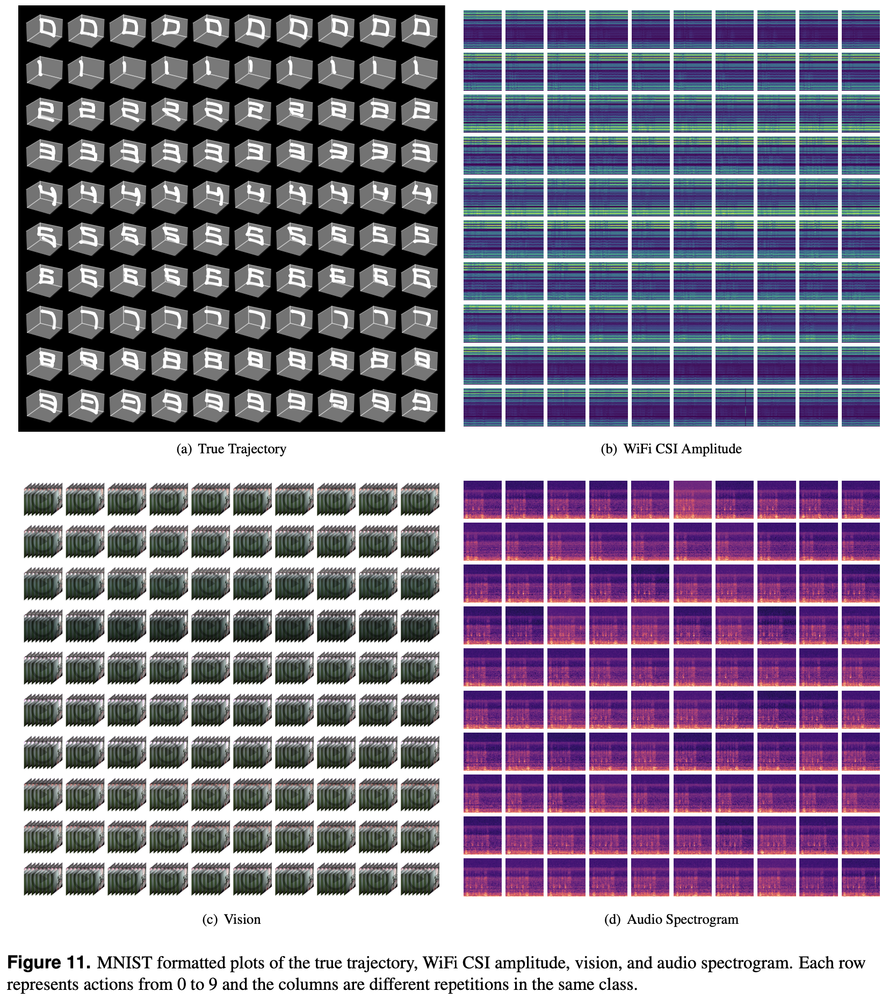
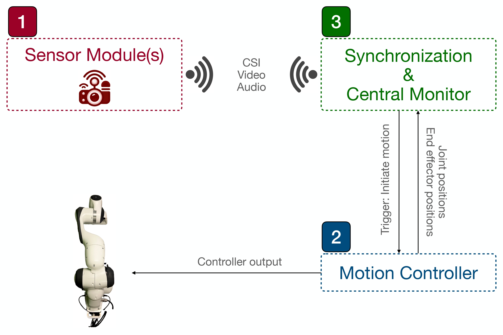

# RoboMNIST
**RoboMNIST: A Multimodal Dataset for Multi-Robot Activity Recognition Using WiFi Sensing, Video, and Audio**

We introduce a novel dataset for multi-robot activity recognition (MRAR) using two robotic arms integrating WiFi channel state information (CSI), video, and audio data. This multimodal dataset utilizes signals of opportunity, leveraging existing WiFi infrastructure to provide detailed indoor environmental sensing without additional sensor deployment. Data were collected using two Franka Emika robotic arms, complemented by three cameras, three WiFi sniffers to collect CSI, and three microphones capturing distinct yet complementary audio data streams. The combination of CSI, visual, and auditory data can enhance robustness and accuracy in MRAR. This comprehensive dataset enables a holistic understanding of robotic environments, facilitating advanced autonomous operations that mimic human-like perception and interaction. By repurposing ubiquitous WiFi signals for environmental sensing, this dataset offers significant potential aiming to advance robotic perception and autonomous systems. It provides a valuable resource for developing sophisticated decision-making and adaptive capabilities in dynamic environments.

https://github.com/user-attachments/assets/b5266bee-0ef5-4132-9270-546de9581254

## Dataset
Please refer to [our paper](https://doi.org/10.1038/s41597-025-04636-2) for a detailed description of our dataset and where you can find the dataset files.

Our dataset is composed of $60$ different primary activity classes performed by the robotic arms, capturing activities through our sensor-rich modules. Our dataset encompasses four variations:

- **Action:** The Franka Emika robotic arms were programmed to draw the numbers $0$ through $9$ on a vertical imaginary plane, resulting in ten distinct classes of activities. We denote the actions performed by the robots as a ∈ {0, 1, ..., 9}.

- **Robot number:** Indicated by r ∈ {1, 2}, this specifies which of the two available robotic arms is performing the activity.

- **Robot velocity:** Denoted by v ∈ {*High*, *Medium*, *Low*}, this describes the velocity level at which the robot performs the action.

- **Motion uncertainty:** Denoted by $u \in \mathbb{R}^+$, where $\mathbb{R}^+$ represents the positive real numbers, measures the $L_2$ norm error of the end effector's position relative to its intended trajectory over time.

The combination of ten actions, two robots performing these actions, and three velocity levels results in a total of $60$ unique primary classes. For primary each class, we have collected $32$ repetitions. Each repetition spans $15$ seconds, during which the robot performs the activity with consistent variations in action, robot arm, and velocity, while incorporating motion uncertainty. This introduces deviations in each repetition as the robot writes on an imaginary plane, adding a realistic layer of complexity to the dataset.


<p align="center">

</p>


## Examples
You can find the Python example notebooks in the [examples folder](examples) of this GitHub repository to help you get started to use the dataset.


## Collection Setup & Code
This section is helpful if you want to understand the details of the data collection process or reproduce the dataset. The diagram below shows the collection setup.

<p align="center">

</p>

The framework consists of three parts:

1. **Sensor Module**  
   This part of the framework reads data from the three sensors (CSI, Video, Audio) and sends it to the central monitor.

2. **Motion Controller**  
   This component handles robot control. It starts the movement when it receives a trigger from the central monitor.

3. **Synchronization & Central Monitor**  
   As the name suggests, this is the central monitoring system. It oversees the data collection process, ensures data synchronization, and is responsible for saving and storing the data.


### Sensor Module
Reading sensor outputs from the camera and microphone is straightforward using OpenCV and sounddevice, respectively. For reading CSI data, we used a Raspberry Pi 4 Model B integrated with the [Nexmon project](https://github.com/seemoo-lab/nexmon). Follow the instructions in the Nexmon project to set up your Raspberry Pi.

To send CSI data over the network, you need to configure `iptables` to forward packets generated by Nexmon to the central monitor. Alternatively, we provide a pre-configured Raspberry Pi image at [this link](https://drive.google.com/file/d/1uHypWQgGp31xnjCbp_p70RBZuLtiQecM/view?usp=sharing). You can clone this image onto your Raspberry Pi, which is ready to use.

To clone the image onto your Raspberry Pi, follow the instructions in [this link](https://pbxbook.com/other/dd_clone.html) for macOS, or use similar methods for other operating systems.

Once the image is set up, connect your Raspberry Pi to a router using an **Ethernet cable** (as the Raspberry Pi will lose WiFi capability when running the Nexmon project). Then, SSH into it using the following credentials:

- **Username**: `pi`
- **Password**: `123456789`


```bash
ssh pi@RASPBERRY_IP
```

Then run the following command to start the CSI broadcast:

```bash
sudo bash setup.sh --laptop-ip <ip> --mac-adr <MAC> --channel <channel> --bandwidth <bandwidth> --core <core> --spatial-stream <spatial stream>
```

 - The `--laptop-ip` specifies the IP address of the central monitor. This central monitor must be connected to the same router as the Raspberry Pi.  
- The `--mac-adr` specifies the MAC address of the transmitter you want to filter.  
- The `--channel`, `--bandwidth`, `--core`, and `--spatial-stream` parameters define the CSI collection specifications (refer to the Nexmon CSI project documentation for more details).  


As an example you can run

```bash
sudo bash setup.sh --laptop-ip 192.168.50.14 --mac-adr f8:4d:89:8e:57:33 --channel 36 --bandwidth 80 --core 1 --spatial-stream 1
```

After that, in the same terminal, you can run the following command to start the audio broadcast:  

 ```bash
python3 audio_broadcast.py --laptopip <ip>
```


### Motion Controller
The code used to control the robot(s) is provided in the [motion_control folder](motion_control). The laptop running the controller must be connected to both the robot and the router that the sniffer and central monitor are connected to. 

You can find the specific configuration in the [config file](motion_control/config.json), which includes the IP address of the robot, the IP address of the central monitor, the speed level, and other settings. More details about these configurations are provided in the paper.

You can build and run the code using the following steps.

 ```bash
mkdir build
cd build
cmake .. # you need the Frankalib installed for C++
make
./main # run the compiled code
```


### Synchronization & Central Monitor

This part of the framework uses ROS2, and the code is available in the [monitor folder](monitor). The `monitor` is a ROS2 workspace with three packages containing the following nodes:

- **csi_node**: Receives CSI data from the module(s), timestamps it, and saves it.

- **camera_node**: Handles video frames from the module(s), timestamps them, and saves them.

- **mic_node**: Collects audio signals from the module(s), timestamps them, and saves them.

- **heartbeat_node**: Acts as a synchronizer, sending heartbeats to all nodes to indicate when they should collect sensor data at each timestep.

Additionally, the `util` package does not include any nodes but contains the `params.yaml` file. This file allows you to configure data collection settings. The specific variables are explained in the file itself.

You can build the project using `colcon build`. To run each node, use the following commands:


```bash
ros2 run pack_wifi csi_node --ros-args --params-file /path/to/the/params/yaml/file
```
```bash
ros2 run pack_camera camera_node --ros-args --params-file /path/to/the/params/yaml/file
```
```bash
ros2 run pack_camera mic_node --ros-args --params-file /path/to/the/params/yaml/file
```

Finally, after all the nodes are running, start the heartbeat node:

```bash
ros2 run pack_wifi heartbeat_node --ros-args --params-file /path/to/the/params/yaml/file
```


## Our Paper
If you use this dataset, code, or any descriptions from this repository, please cite our paper.

```
@article{Behzad2025,
  author = {Behzad, Kian and Zandi, Rojin and Motamedi, Elaheh and Salehinejad, Hojjat and Siami, Milad},
  year = {2025},
  title = {RoboMNIST: A Multimodal Dataset for Multi-Robot Activity Recognition Using WiFi Sensing, Video, and Audio},
  journal = {Nature Scientific Data},
  pages = {326},
  volume = {12},
  number = {1},
  doi = {10.1038/s41597-025-04636-2},
}
```


<!-- ## Acknowledgements
We use [nexmon project](https://github.com/seemoo-lab/nexmon_csi) for extracting WiFi CSI information in our modules. -->
