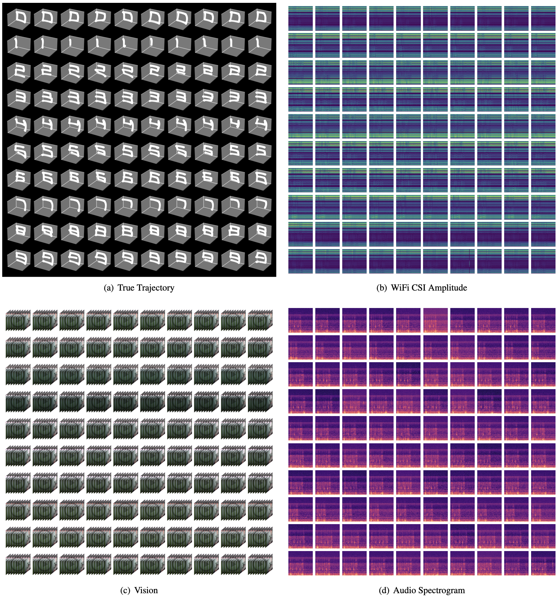

# RoboMNIST
**RoboMNIST: A Multimodal Dataset for Multi-Robot Activity Recognition Using WiFi Sensing, Video, and Audio**

We introduce a novel dataset for multi-robot activity recognition (MRAR) using two robotic arms integrating WiFi channel state information (CSI), video, and audio data. This multimodal dataset utilizes signals of opportunity, leveraging existing WiFi infrastructure to provide detailed indoor environmental sensing without additional sensor deployment. Data were collected using two Franka Emika robotic arms, complemented by three cameras, three WiFi sniffers to collect CSI, and three microphones capturing distinct yet complementary audio data streams. The combination of CSI, visual, and auditory data can enhance robustness and accuracy in MRAR. This comprehensive dataset enables a holistic understanding of robotic environments, facilitating advanced autonomous operations that mimic human-like perception and interaction. By repurposing ubiquitous WiFi signals for environmental sensing, this dataset offers significant potential aiming to advance robotic perception and autonomous systems. It provides a valuable resource for developing sophisticated decision-making and adaptive capabilities in dynamic environments.

https://github.com/user-attachments/assets/b5266bee-0ef5-4132-9270-546de9581254

## Dataset
Please refer to [our paper TODO](http://TODO.com) for a detailed description of our dataset and where you can find the dataset files.

Our dataset is composed of $60$ different primary activity classes performed by the robotic arms, capturing activities through our sensor-rich modules. Our dataset encompasses four variations:

- **Action:** The Franka Emika robotic arms were programmed to draw the numbers $0$ through $9$ on a vertical imaginary plane, resulting in ten distinct classes of activities. We denote the actions performed by the robots as a ∈ {0, 1, ..., 9}.

- **Robot number:** Indicated by r ∈ {1, 2}, this specifies which of the two available robotic arms is performing the activity.

- **Robot velocity:** Denoted by v ∈ {*High*, *Medium*, *Low*}, this describes the velocity level at which the robot performs the action.

- **Motion uncertainty:** Denoted by $u \in \mathbb{R}^+$, where $\mathbb{R}^+$ represents the positive real numbers, measures the $L_2$ norm error of the end effector's position relative to its intended trajectory over time.

The combination of ten actions, two robots performing these actions, and three velocity levels results in a total of $60$ unique primary classes. For primary each class, we have collected $32$ repetitions. Each repetition spans $15$ seconds, during which the robot performs the activity with consistent variations in action, robot arm, and velocity, while incorporating motion uncertainty. This introduces deviations in each repetition as the robot writes on an imaginary plane, adding a realistic layer of complexity to the dataset.


<p align="center">

</p>


## Examples
You can find the Python example notebooks in the [examples folder](examples) of this GitHub repository to help you get started to use the dataset.

## Our Paper
If you use this dataset for your academic research, please cite our paper.

```
@article{todo,
  title={},
  author={},
  journal={}, 
  year={},
  volume={}, 
  number={}, 
  pages={}
}
```


## Acknowledgements
We use [nexmon project](https://github.com/seemoo-lab/nexmon_csi) for extracting WiFi CSI information in our modules.
